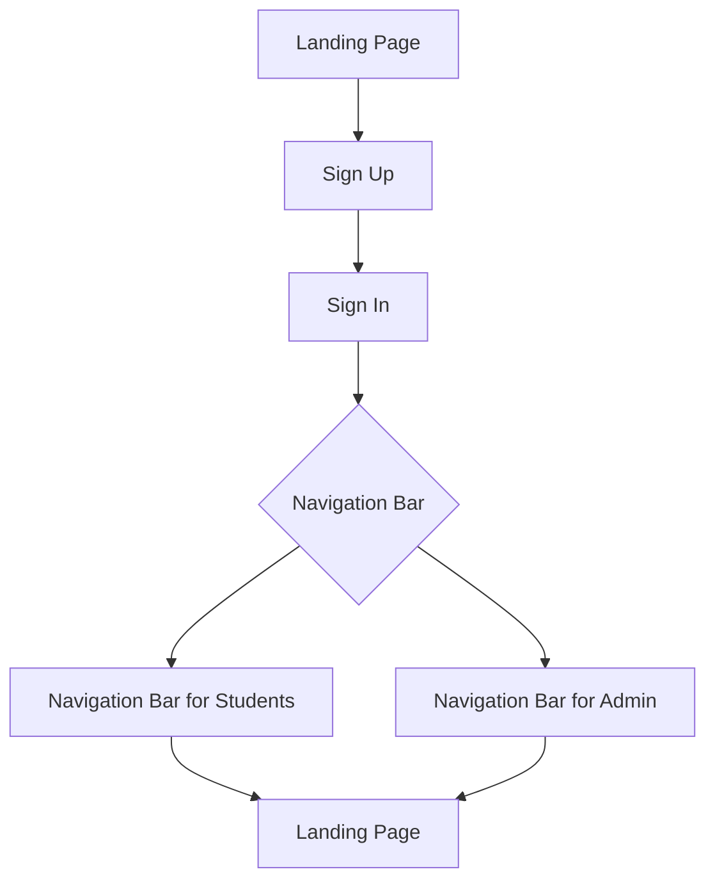

# Welcome to Eventify!
# Project: Eventify
- Student: 10145140
- Live: http://127.0.0.1:5173/Home

Eventify is a dynamic web application that is built using the latest technologies including React, Vite, CSS and Firebase.This technical report provides an in-depth analysis of Eventify, a React application designed for booking events, with a particular focus on students. Eventify offers a comprehensive set of features, including indoor, outdoor, and online event information shared collaboratively with teams. This report will discuss the various React components, routers, and the integration of Firebase sign-in functionality within the application. The purpose of this project is to provide an efficient and reliable solution to university students who are looking for events to spend time with and to meet new students.

Using Eventify, students can easily navigate through a range of options for indoor, outdoor and online events. The application simplifies the process of finding an event that can be attended both individually and in a group. One of the main goals is to create a common link between students of the same University.

The app is built using React, a popular JavaScript library for building user interfaces. Vite is used as a build tool and development server, which allows for fast and efficient development. CSS is used to style the app, providing a simple and intuitive design that is optimized for all devices.

Firebase is used for the backend, providing features such as authentication, real-time database, and storage. This allows for secure and reliable data storage and retrieval, as well as easy integration with other Firebase products.

In general, Eventify offers solutions for university students looking to have fun and meet other students. With a compact, simple design and user-friendly interface, it provides a perfect experience for users, simplifying the process of finding one or more desired events.

# Installation

Clone this repository: git clone https://github.com/PetrisorPredescu/Eventify

Navigate to the project directory: **cd Eventify**

Install the necessary dependencies: **npm install**

Create a file named ".env" and paste the following env variables:

```sh
VITE_API_KEY=
VITE_AUTH_DOMAIN=.firebaseapp.com
VITE_PROJECT_ID=
VITE_STORAGE_BUCKET=
VITE_MESSAGING_SENDER_ID=
VITE_APP_ID=
VITE_MEASUREMENT_ID=
```

Start the development server: npm run dev

# Characteristics

User authentication: allowing users to create an account, log in, and manage their profile.

Events filter: allowing user to filter the events by date or by type.

Event search: allowing users to browse and search for events based on various criteria, such as indoor, outdoor and online.

Messaging: enabling users to communicate with admins within the app.

# Technologies Used

React: React is a free and open-source front-end JavaScript library for building user interfaces based on components.

Vite: Vite is a platform-agnostic frontend tool for building web applications quickly and solves some common developer headaches.

CSS: Cascading Style Sheets is a style sheet language used for describing the presentation of a document written in a markup language such as HTML or XML.

Firebase: Firebase is a set of backend cloud computing services and application development platforms provided by Google. It hosts databases, services, authentication, and integration for a variety of applications

# Types of functions

Types of User  | Action
------------- | -------------
Student  | CRUD Profile, Join/Leave Events, Enquiries, Reviews
Admin | CRUD Students/Events/Messages, Reviews


# Data Flow Chart




